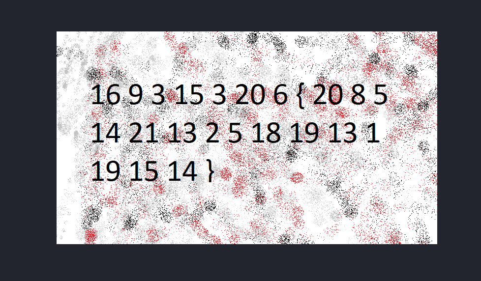

Challenge:
```
The numbers... what do they mean?
```
They provide me with a image which have numbers



When I see this kind of numbers I always try to get the hex value of it but seeing this numbers all are below 26, that is the total alphabet in English. Each number in this
picture is representing a letter so with that I went to ```cyberchef ``` which have a recipe called ```A1Z26 Cipher``` which will treat numbers as alphabet. After running
this recipe I got the flag

```
flag : picoCTF{thenumbersmason}
```
