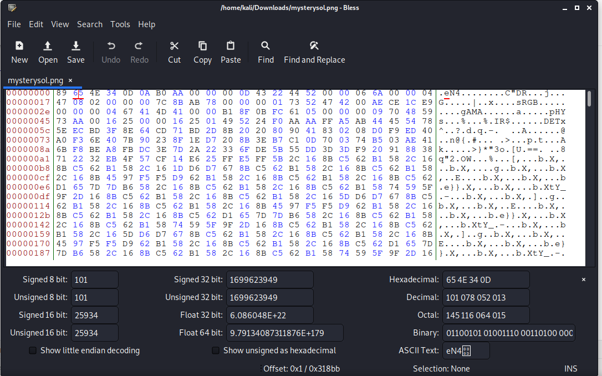
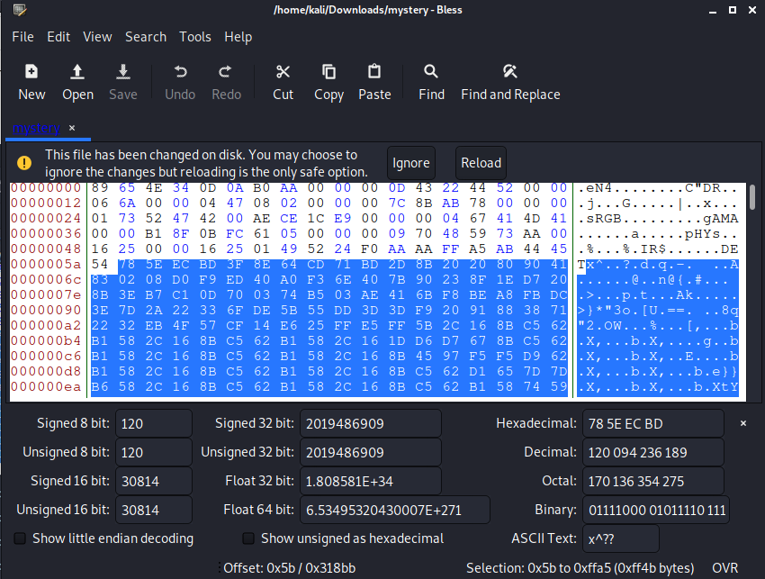
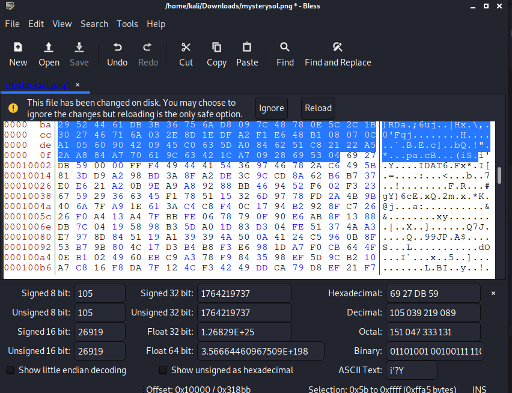

Challenge
```
We found this file. Recover the flag.
```

They gave us the file called mystery and running file command gave me
```
mystery: data
```
I used strings to get the readable character of the file and got ```IEND``` as the last line so it is probably a png file
So to view the hex dump i used bless it has more features than the hexeditor in linux



looks like the magic bytes, ```IHDR``` and ```IDAT```is wrong so replacing it with correct one

PNG magic bytes ```89 50 4E 47 0D 0A 1A 0A```
PNG IHDR ```49 48 44 52```
PNG IDAT ```49 44 41 54```

The chunk size is ```AA AA FF A5``` which is very big than usual. So I select the chuck from IDAT to ```FF AF```




The bottom right corner will have the size we selected until now and it says ```0xffa5``` so just change the chunk size ```AA AA FF A5``` to 
```00 00 FF A5``` after saving the file . I ran pngcheck on it

```
pngcheck mystery
mysterysol.png CRC error in chunk pHYs (computed 38d82c82, expected 495224f0)
```

So just change the expected with the computed in the pHYs chunk and saving that and opening the image gave me the flag

flag ```picoCTF{c0rrupt10n_1847995}```
