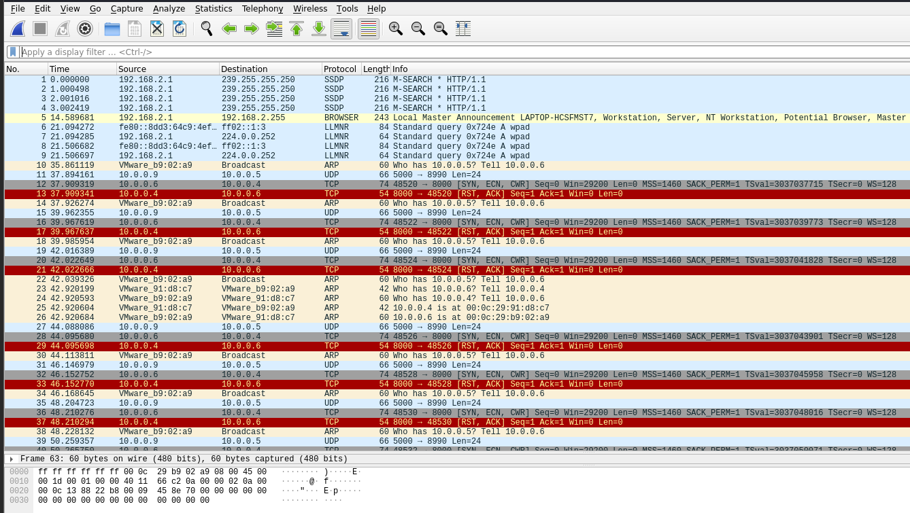
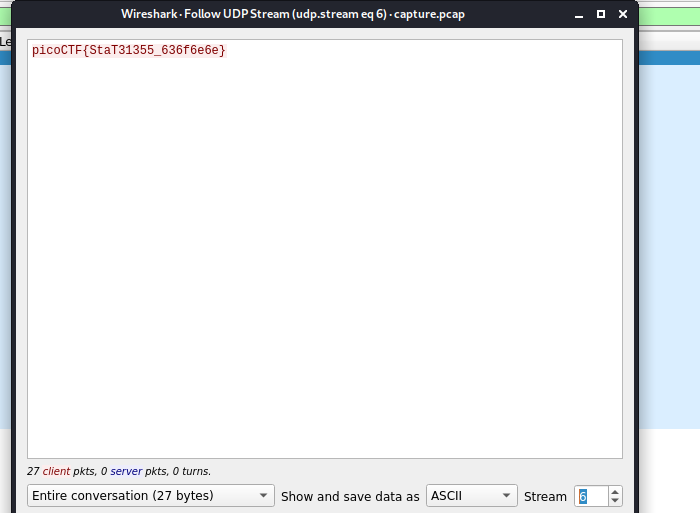

Challenge:
```
We found this packet capture. Recover the flag.
```

This time they gave me a ```capture.pcap``` file . Opening in wireshark



We can see it has ```TCP, UDP etc``` packets. So following the tcp stream doesn't gave me anything so next I saw the udp stream



On ```stream 6``` it gave me the flag

flag:```picoCTF{StaT31355_636f6e6e}```
