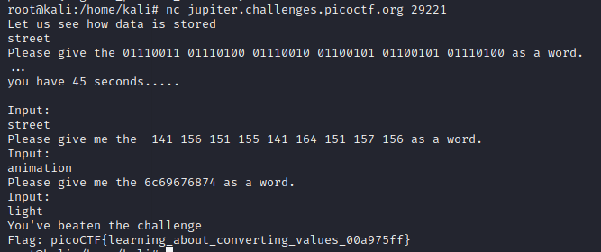

Challenge:
```
To get truly 1337, you must understand different data encodings, such as hexadecimal or binary. Can you get the flag from this program to prove you are on the way to becoming 1337? 
Connect with nc jupiter.challenges.picoctf.org 29221.
```

Connecting to the server gave me 3 encoding to solve, ```binary, octal and hexadecimal``` and we have to convert it in ascii in given time.
I used ```https://gchq.github.io/CyberChef/#input=Cg``` for decoding which is very popular tool for common encodings and forensics.



flag:```picoCTF{learning_about_converting_values_00a975ff}```
