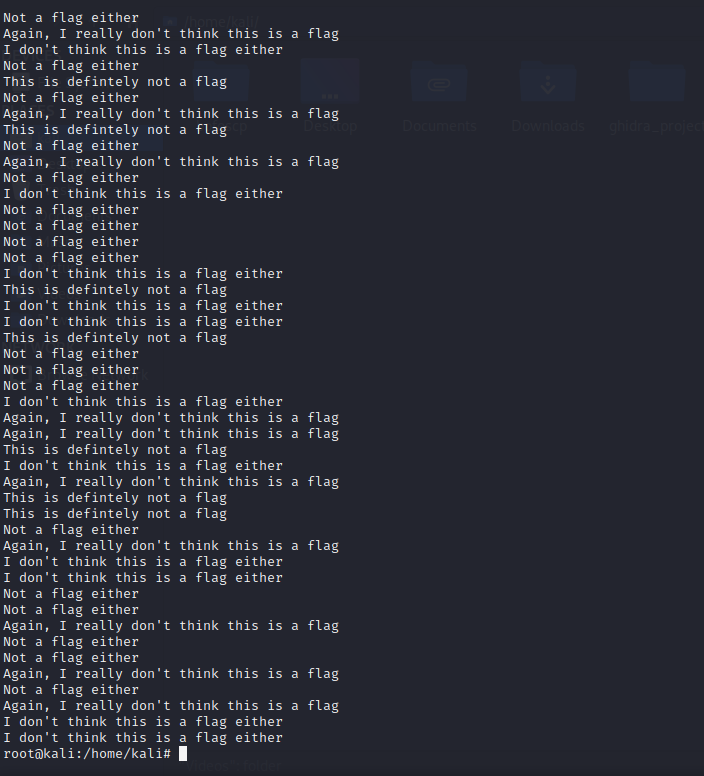

Challenge:
```
Sometimes you need to handle process data outside of a file. Can you find a way to keep the output from this program and search for the flag?
Connect to jupiter.challenges.picoctf.org 7480.
```

Connecting to the server gave me



and it closes the connection. Not that the challenge named ```plumbing``` so I thought of the `|` in linux by which we can give the output
of a command to the input of another. So i used to command
```
nc jupiter.challenges.picoctf.org 7480 | grep pico
```

It gave me the flag

flag: ```picoCTF{digital_plumb3r_06e9d954}```
