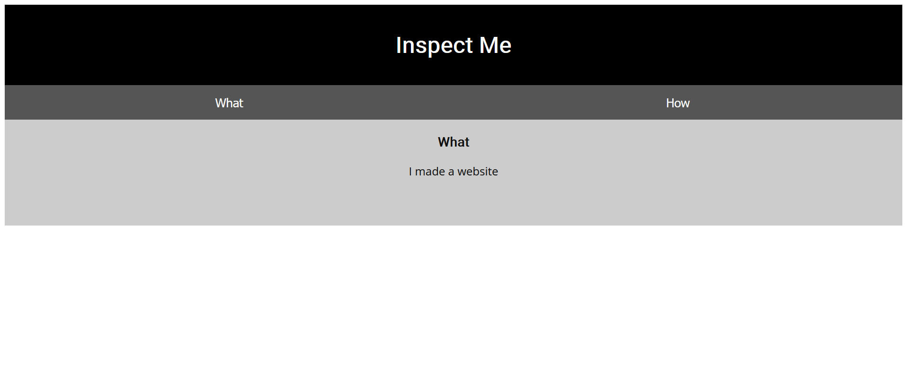

Challenge:
```
Kishor Balan tipped us off that the following code may need inspection: https://jupiter.challenges.picoctf.org/problem/41511/
```
Looking at the website it says inspect me


So right clicking the website and clicking on the inspect element and checking the html
``` 
Html is neat. Anyways have 1/3 of the flag: picoCTF{tru3_d3 
```
So it gave us one-third of the flag so checking the css in the style editor i got

```
You need CSS to make pretty pages. Here's part 2/3 of the flag: t3ct1ve_0r_ju5t
```
Now checking the javascript in the Debugger tab gave me
```
Javascript sure is neat. Anyways part 3/3 of the flag: _lucky?832b0699}
```
So after combining these three parts gave me the flag

``` 
picoCTF{tru3_d3t3ct1ve_0r_ju5t_lucky?832b0699}
```
