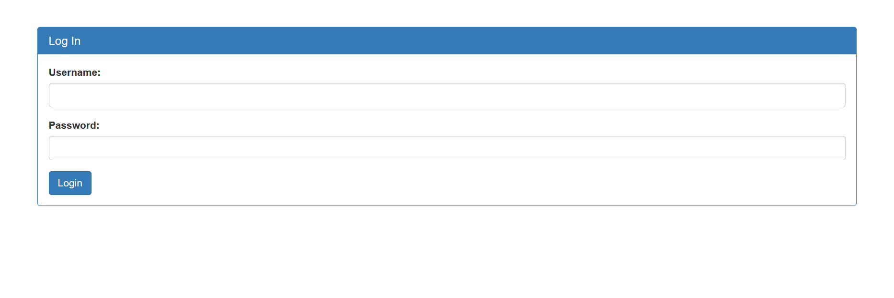

Challenge:
```
There is a website running at https://jupiter.challenges.picoctf.org/problem/33850/ 
Do you think you can log us in? Try to see if you can login!
```
Going to the link and access the admin login


When I see a login page I first see if default login creds work if not then I go for SQL Injection. In this default creds doesn't work so i tried normal SQL Injection
I used ```admin';``` for the username and anything for password and it bypassed the login. What I did was just guessed the higher user would be ```admin``` and used ```;``` to comment
out rest of the matching case from the database query which logged me as admin

The flag is ```picoCTF{s0m3_SQL_f8adf3fb}```
