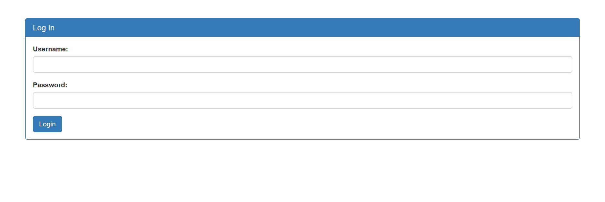

Challenge:
```
There is a website running at https://jupiter.challenges.picoctf.org/problem/64649/. 
Someone has bypassed the login before, and now it's being strengthened. Try to see if you can still login!
```

As the name it was the sequel of the previous challenge Irish-Name-Repo 1 and now it states it is more secure
Let's see the admin login



it looks the same. I tried the same SQL injection as before ```admin';``` and guess what it bypassed this as well.
And gave me the flag 
```
picoCTF{m0R3_SQL_plz_aee925db}
```

