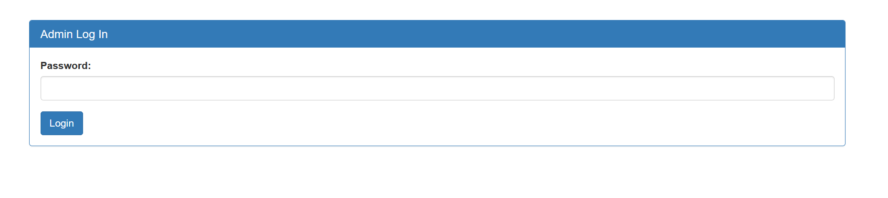
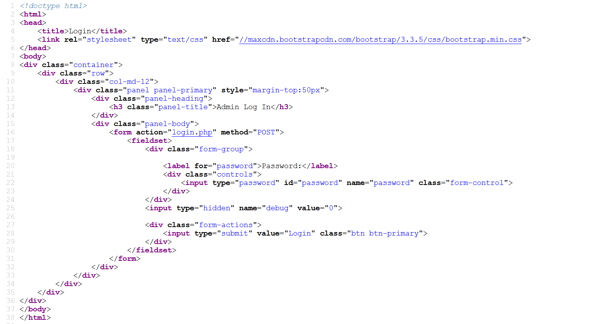

Challenge:
```
There is a secure website running at https://jupiter.challenges.picoctf.org/problem/54253/ . Try to see if you can login as admin!
```
This is again the sequel of the previous Irish repo but this time it was different. Looking at the admin login I can see it was different this time



This time it was only asking for password. I used ```pass``` as the password and it said ```Login failed```. I then checked the source of the page



And saw a hidden attribute whose value was set to 0 so i changed the value of the attribute from 0 to 1. This can be done in the developer tools of the browser
So after this i again used ```pass``` as the password but this time I had the following output

```
password: pass
SQL query: SELECT * FROM admin where password = 'cnff'

Login failed.
```
By seeing the password it was changed from pass to cnff. I have played quite a few ctfs so I know it is a rot13 cipher i.e., every alphabet is shifted 13 times and also it 
gave me the SQL query. So i used ```' or 1=1--```. This will look like 
```
SQL query: SELECT * FROM admin where password = '' or 1=1--
```
which will not check for admin password and set to always true. But as this webpage is using rot13 so the ```or``` in the injection will be changed to ```be```
So i changed the injection to ```' be 1=1--``` which will be changed to ```' or 1-1--``` after applying rot13 so the injection will work and will give the flag

```
picoCTF{3v3n_m0r3_SQL_7f5767f6}
```
