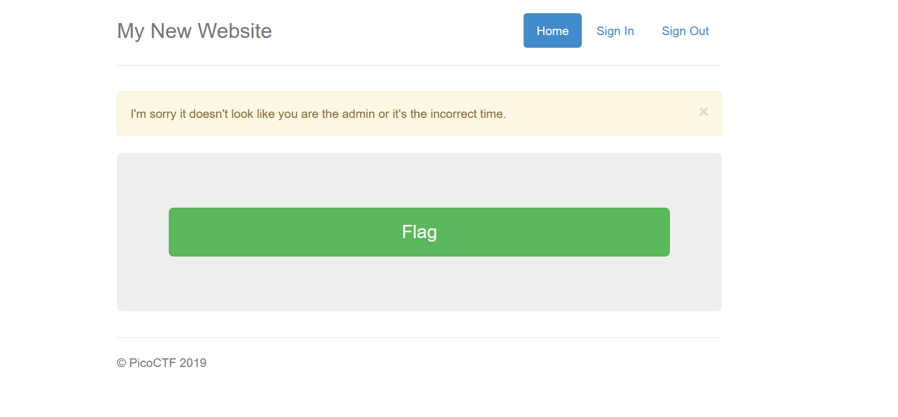

Challenge:
```
This secure website allows users to access the flag only if they are admin and if the time is exactly 1400. https://jupiter.challenges.picoctf.org/problem/31787/
```

Going to the website and clicking on the flag gave me this


I was in here for some time figuring out what is 1400 and after some time I thought of adding my own values in the cookies. To access the cookies press Ctrl+shift+i in your keyboard to open the inspection panel and go to the storage tab and find the cookies , add the cookies using plus symbol. The cookies should be 
```
admin : true
time  : 1400
```
And after that refresh the page and get the flag
```
picoCTF{0p3n_t0_adm1n5_7f5e0eb0}
```
