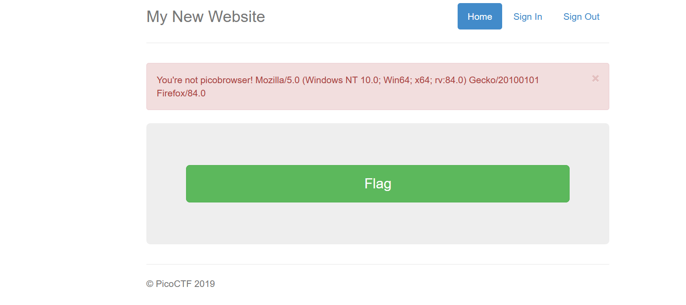

Challenge:
```
This website can be rendered only by picobrowser, go and catch the flag! https://jupiter.challenges.picoctf.org/problem/26704/
```

Going to the link, there was a flag button clicking on that gave me this


I curl the webpage with the user-agent ```picobrowser```, the command was
```
curl -A "picobrowser"  https://jupiter.challenges.picoctf.org/problem/26704/flag
```
by running this gave me the flag
```
picoCTF{p1c0_s3cr3t_ag3nt_e9b160d0}
```
